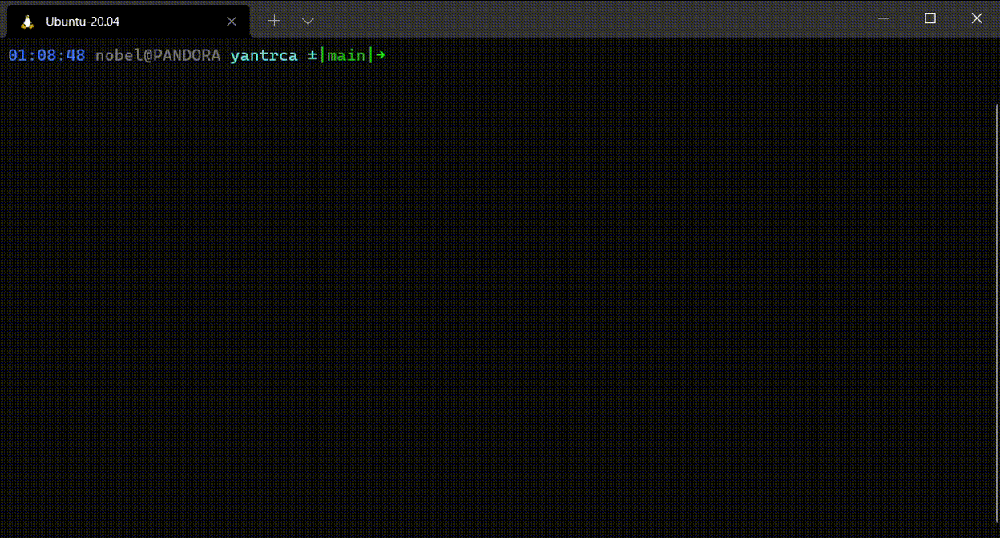

# YANTRCA - Yet Another Note Taking Ruby Console App

A console app to save your notes.

## Motivation

I wanted to see how console programs like nano, htop work. So, I tried to build a really simple application that will be only run from a terminal shell and it's user interface is within the console.

## Demo



## Technology

As this is a simple console app, there is not many external packages or services used here. I only used the Ruby language and it's `curses` package. That package is used to create the user interface and catch user input from terminal.

## How to run

+ Clone this repository
+ Change working directory to cloned repository's directory
+ Run the following command -

```bash
ruby program.rb
```

After starting the app, `Ctrl-A` can be used to add a new note and `Ctrl-C` to close the app. All available actions on a screen are shown at the bottom of the screen.

## ToDo

+ [ ] Terminal window resize support
+ [ ] Scrolling

## Helpful Resources

To build an app like this, the below resources were very helpful -

+ [Ruby Curses Tutorial](https://stac47.github.io/ruby/curses/tutorial/2014/01/21/ruby-and-curses-tutorial.html)
+ [NCurses Programming HOWTO](https://tldp.org/HOWTO/NCURSES-Programming-HOWTO/)
+ [NCurses Manual](https://invisible-island.net/ncurses/man/ncurses.3x.html)
+ [Ruby Curses Documentation](https://www.rubydoc.info/gems/curses)
+ [Ruby Curses Examples](https://github.com/ruby/curses/tree/master/sample)

## License

This work is under the [MIT License](LICENSE).
